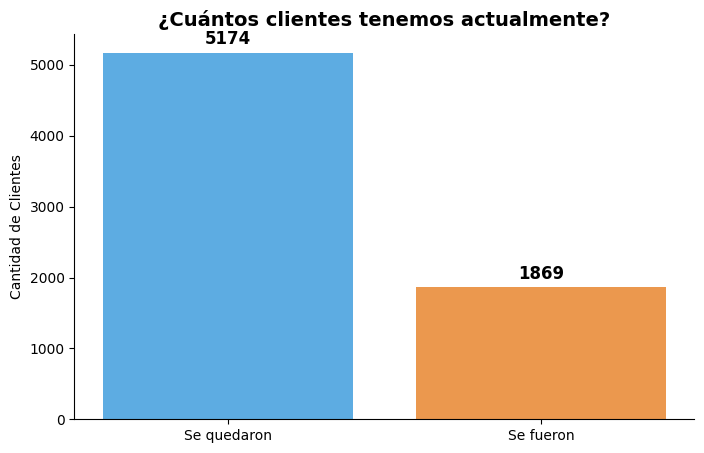
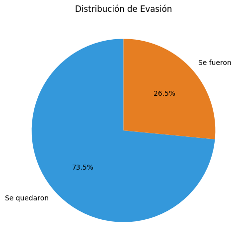
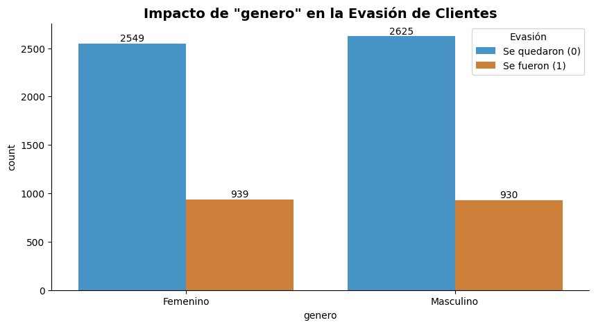
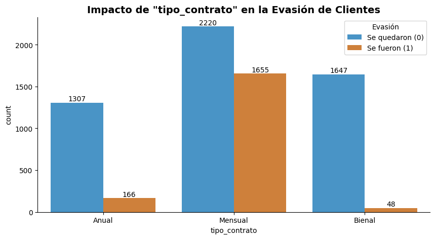
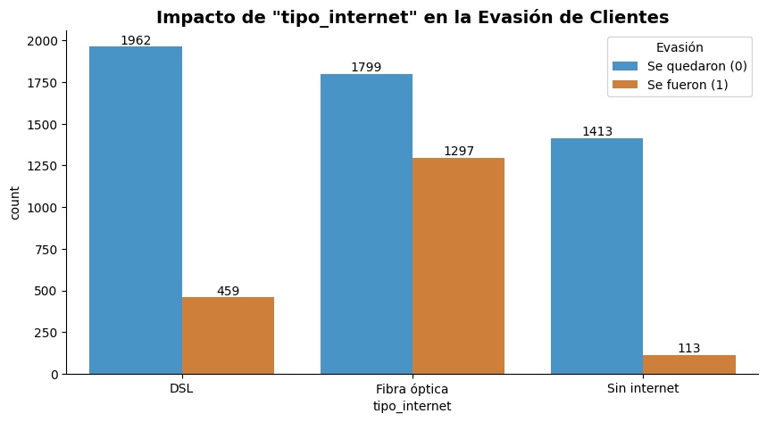
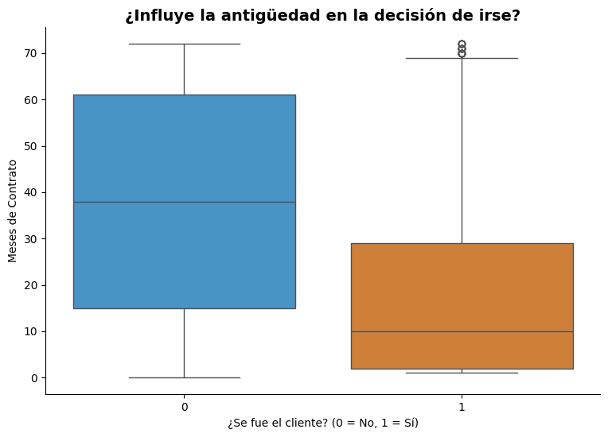
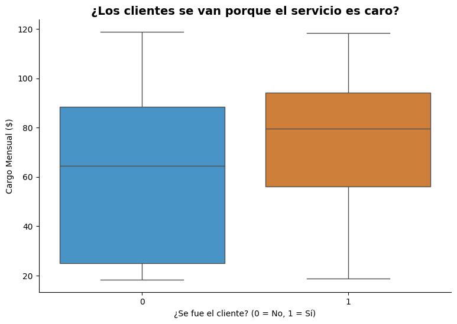
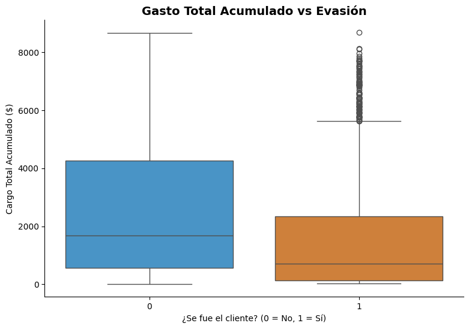

# Challenge_TelecomX_LATAM

# 🚀 Proyecto TelecomX LATAM: Análisis de Evasión de Clientes (Churn)

¡Hola! Soy **Marilu Fiorela**, analista de datos y estudiante de Economía. En este proyecto, utilicé Python para analizar el comportamiento de los clientes de una empresa de telecomunicaciones y descubrir por qué algunos deciden cancelar su servicio.

## 📋 Objetivo del Proyecto
Identificar los factores clave que influyen en la evasión de clientes (Churn) en Telecom X para proponer estrategias de retención basadas en datos.

## 🛠️ Herramientas Utilizadas
* **Lenguaje:** Python 3.x
* **Librerías:** Pandas, Matplotlib, Seaborn, Requests.
* **Entorno:** Google Colab.

---

## 🏗️ Fases del Proyecto

### 1. Extracción y Limpieza de Datos
El dataset se obtuvo vía API en formato JSON. Se realizaron procesos de limpieza críticos:
* **Tratamiento de Nulos:** Se identificaron y corrigieron datos faltantes en la columna `cargo_total`.
* **Estandarización:** Traducción de variables al español y conversión de respuestas binarias (Yes/No) a formato numérico (1/0).

### 2. Análisis Exploratorio (EDA)
Descubrimos que la tasa de evasión es del **26.5%**. 

#### 📊 Distribución de Evasión

### 3. Hallazgos Principales (Insights)

#### 📉 ¿Influye el tipo de contrato?
Los datos revelan que los clientes con contratos **"Mes a mes"** tienen una probabilidad de fuga significativamente mayor en comparación con los contratos anuales.

#### 💰 El factor Precio y Antigüedad
A través de diagramas de caja (Boxplots), confirmamos que:
1. Los clientes que se van tienen cargos mensuales más altos.
2. La mayoría de las cancelaciones ocurren durante los primeros meses de servicio.

### 4. Matriz de Correlación
Utilicé un mapa de calor para identificar qué variables tienen mayor peso sobre la evasión.

---

## 💡 Conclusiones y Recomendaciones
* **Fidelización Temprana:** Es vital reforzar la atención al cliente en los primeros 6 meses.
* **Incentivos:** Promover el cambio de contratos mensuales a anuales mediante descuentos.
* **Calidad de Servicio:** Revisar la infraestructura de Fibra Óptica, ya que presenta mayores índices de baja.

---

## 👩‍💻 Cómo ejecutar este proyecto
1. Clona el repositorio.
2. Abre el archivo `.ipynb` en Google Colab o Jupyter Notebook.
3. Ejecuta todas las celdas para replicar el análisis.

---
